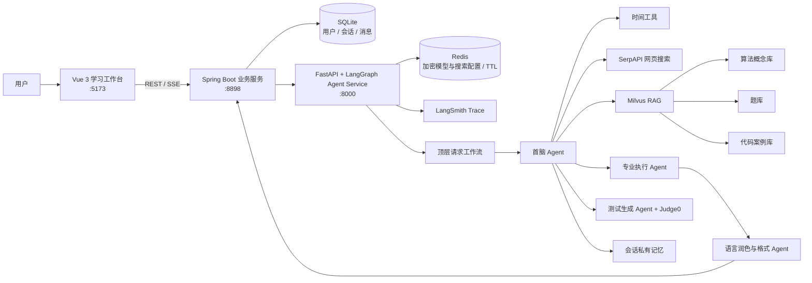

# AlgoMate · 智能算法学习平台

AlgoMate 是一个基于 **Vue 3 + Spring Boot + FastAPI + LangGraph** 的多智能体算法学习平台。它将对话理解、动态任务规划、会话记忆、上下文压缩、RAG 检索、网页搜索与流式输出组合成一条可观测的学习链路，面向算法概念讲解、题目推荐、代码分析和学习规划等场景。

> 当前仓库是可运行的工程版本：前后端、SQLite 会话持久化、多 Agent 编排、Milvus RAG、SerpAPI 搜索、上下文与私有记忆管理以及 Judge0 多语言代码执行均已接通。完整账号体系和生产部署仍在规划中。

## 核心能力

- **分层 LangGraph 编排**：顶层图管理输入、上下文、意图、画像、记忆、回答与格式化的完整生命周期；内部子图由首脑 Agent 根据最新状态动态选择时间工具、RAG、网页搜索、专业执行 Agent、记忆写入、澄清或结束。
- **LangSmith 可观测性**：完整请求图与内部决策子图共享同一条父子 Trace，可查看节点输入输出、调用顺序、耗时和异常。
- **真实代码验证闭环**：测试生成 Agent 为候选 Python/Java/C++ 代码构造样例、边界、对抗和小规模 Oracle Harness；独立 Reflection Critic 审查候选调用、Oracle 正确性、约束与覆盖并触发修订，Judge0 再负责真实编译运行。源码 SHA-256 将报告绑定到代码版本，失败后由实现 Agent 修复并重新执行。
- **结构化意图识别**：输入整理、指代改写和 TaskSpec 识别分层执行，为后续 Agent 提供目标、约束、交付格式和所需能力。
- **上下文预算与压缩**：默认使用 32K 上下文窗口，保留输出预算；只有活跃上下文超过安全阈值时才创建统一压缩检查点。
- **会话级私有记忆**：偏好、目标、约束、学习事实和未完成任务按照 `user_id + session_id` 隔离存储，避免不同对话串线。
- **部署级服务配置**：用户在前端分别保存 OpenAI 兼容模型连接与 SerpAPI Key；两类凭据可独立新增、更新和删除，无登录模式下作为当前部署的全局配置加密存入 Redis并支持自定义 TTL，业务 Key 不进入 `.env`、SQLite 或聊天记录。
- **三库 RAG**：算法概念库、题库和代码案例库分别建库，使用 Voyage Embedding 和 Milvus 向量检索；用户记忆作为动态增长的第四类知识源。
- **时效信息检索**：通过 SerpAPI 搜索外部资料，并提供当前时间工具；证据不足时由首脑 Agent 重新规划可交付的替代内容。
- **SSE 流式体验**：Spring Boot 统一承接业务请求，向前端推送 Agent 进度、断线重试状态和最终回答。
- **Markdown 富文本输出**：支持代码块、链接、标准 GFM 表格、列表和分隔线；格式 Agent 失败时安全回退，不丢失已生成答案。
- **RAG 可视化与评测**：前端展示知识库覆盖率、分布和样例；离线脚本支持 TopK、Voyage Rerank、Recall、Precision、MRR、MAP 与 nDCG 等指标。

## 系统架构



### 分层 LangGraph 链路

```text
顶层图：会话隔离 → 输入整理 → 上下文准备 → 输入改写 → 意图识别
          → 上下文提交 → 学习画像 → 记忆观察 → Agent Runtime 子图
          → 润色 → 格式整理 → 响应装配

内部子图：首脑决策
          ├─ 当前时间 ───────────────┐
          ├─ RAG 检索 ──────────────┤
          ├─ 网页搜索 ──────────────┤
          ├─ Judge0 代码执行 ───────┤
          ├─ 私有记忆写入 ──────────┤→ 返回首脑继续决策
          ├─ 专业 Agent 委派 ───────┘
          ├─ 澄清 → END
          └─ 完成 → END
```

首脑 Agent 会在每次工具或专业 Agent 返回后重新读取运行状态。若精确目标受限于外部数据或证据不足，它会明确说明差异，并根据当前会话目标、记忆和已有资料规划最接近的可用结果。

## RAG 设计

| 知识库 | 内容 | Embedding | 当前入选文档 | 当前向量分块 |
| --- | --- | --- | ---: | ---: |
| 算法概念库 | 代码随想录专题、方法与学习路线 | `voyage-4` | 297 | 1,767 |
| 题库 | LeetCode 题面、示例与约束 | `voyage-4` | 106 | 109 |
| 代码案例库 | 与题目配对的高质量解析和代码 | `voyage-code-4` | 106 | 175 |
| 用户私有记忆 | 目标、偏好、约束和学习轨迹 | 当前为会话级文本召回 | 动态增长 | — |

检索仍由 LangGraph 内部子图的首脑 Agent 动态触发。RAG 节点对首脑指定的单个知识库并行执行两路召回：Voyage Query Embedding + Milvus COSINE 稠密检索负责语义匹配，内存 BM25 倒排索引负责题号、算法名、函数名和关键字精确匹配；两路各取 Top-20 文档，通过 RRF 合并为 Top-20 候选，再由 `rerank-2.5` 精排并返回首脑要求的 Top-K。每条证据保存 Dense、BM25、RRF 与 Rerank 排名/分数，能够在 LangSmith 的 Graph State 中审查。单个阶段不可用时会降级到剩余召回路径，Milvus 整体不可用时才退回本地文字匹配。

BM25 索引直接基于 Milvus 中已导入的分块正文按库懒加载构建，并在导入报告变化时自动失效，因此升级混合检索不需要重新消耗 Embedding 配额。

抓取正文、清洗语料和本地向量文件不进入 Git，避免提交第三方网页内容与可再生大文件。仓库保留可复现的数据流水线、数据说明和人工编写的评测用例，详情见 [RAG 数据说明](rag-data/README.md)。

## 上下文与记忆策略

1. 优先复用最近一次压缩检查点，只追加检查点之后的新消息。
2. 将当前输入、TaskSpec、历史消息、系统提示词和输出预留共同纳入 token 预算。
3. 活跃上下文未超过安全预算时保留原文，不为每轮对话调用压缩模型。
4. 超过阈值后，由压缩 Agent 将当前上下文一次性替换为新的结构化检查点。
5. 压缩前将目标、偏好、固定约束和未完成事项写入当前会话的持久记忆。
6. 之后继续采用“检查点 + 新消息”，直到再次触发预算阈值。

默认配置：

| 参数 | 默认值 |
| --- | ---: |
| 上下文窗口 | 32,768 tokens |
| 软限制 | 24,576 tokens |
| 硬限制 | 28,672 tokens |
| 输出预留 | 8,192 tokens |
| 模型断连重试上限 | 5 次 |
| Dense / BM25 候选 | 各 20 条文档 |
| RRF 平滑常数 | 60 |
| Rerank 候选 | 20 条文档 |

## 技术栈

| 层级 | 技术 |
| --- | --- |
| 前端 | Vue 3、TypeScript、Vite |
| 业务后端 | Java 21、Spring Boot 3.4、Spring Data JPA、SSE |
| Agent 服务 | Python、FastAPI、LangGraph、Pydantic、Judge0 SDK、异步 HTTP |
| 数据存储 | SQLite、Redis、Milvus Lite |
| 模型与检索 | DeepSeek、Voyage Embedding/Rerank、SerpAPI、LangSmith Trace |
| 测试 | Judge0、Pytest、Spring Boot Test、Vue Type Check、Vite Build |

## 目录结构

```text
algorithmMultiAgents/
├─ docker-compose.yml         # 三服务容器编排与持久化卷
├─ frontend/                 # Vue 聊天工作台与 RAG 可视化
├─ backend/                  # Spring Boot REST/SSE 与 SQLite 业务层
├─ agent-service/            # FastAPI 多 Agent 编排服务
│  ├─ app/core/              # Agent、上下文、记忆、RAG、搜索与工具
│  └─ tests/                 # Agent 协议与业务测试
├─ database/                 # SQLite 基线结构
├─ scripts/                  # RAG 抓取、清洗、Embedding 与评测脚本
├─ rag-data/                 # 数据说明和人工黄金测试集
└─ docs/                     # 架构与评测文档
```

## Docker 一键部署（推荐）

Docker 部署会启动四个容器：Nginx 托管 Vue 页面并代理 `/api`，Spring Boot 负责业务和 SQLite，FastAPI 负责多 Agent、记忆与 RAG，Redis 保存当前部署的全局加密模型与 SerpAPI 配置。容器之间通过 Compose 内部网络通信，宿主机默认只开放 `8080` Web 端口，Redis 不开放公网端口。

### 1. 准备配置

安装 Docker Engine（或 Docker Desktop）及 Docker Compose 2，然后在仓库根目录创建配置文件：

```powershell
Copy-Item agent-service/.env.example .env
```

Linux 或 macOS 使用：

```bash
cp agent-service/.env.example .env
```

编辑 `.env`，至少替换下面两个服务器端安全参数：

```dotenv
REDIS_PASSWORD=replace_with_a_strong_redis_password
MODEL_CONFIG_ENCRYPTION_KEY=replace_with_at_least_24_random_characters
ALGOMATE_HTTP_PORT=8080
```

`MODEL_CONFIG_ENCRYPTION_KEY` 用于加密 Redis 中的服务配置，生产环境应使用随机且不可复用的长字符串。模型 API Key、模型名称、API URL 和 SerpAPI Key 不再写入 `.env`，启动后由使用者在前端“模型设置”页面填写。Voyage 仍用于向量检索；SerpAPI 未配置时网页搜索能力会降级。若 `8080` 已被占用，可修改 `ALGOMATE_HTTP_PORT`。

可以用 Python 生成随机加密密钥，再复制到 `.env`：

```bash
python -c "import secrets; print(secrets.token_urlsafe(48))"
```

### 2. 构建并启动

```bash
docker compose up --detach --build
```

启动完成后访问 [http://localhost:8080](http://localhost:8080)。首次构建需要下载 Node、Maven、Java 和 Python 依赖，耗时取决于网络环境。

常用管理命令：

```bash
docker compose ps
docker compose logs --follow
docker compose down
```

`docker compose down` 不会删除持久化数据；只有明确执行 `docker compose down --volumes` 才会同时删除 SQLite 数据和 Agent 私有记忆。

### 3. 数据持久化与 RAG

| 数据 | 容器位置 | 持久化方式 |
| --- | --- | --- |
| SQLite 会话数据库 | `/app/data` | `backend-data` 命名卷 |
| 用户私有记忆 | `/app/agent-service/data` | `agent-memory` 命名卷 |
| 加密模型配置与过期时间 | `/data` | `redis-data` 命名卷 |
| RAG 原文、清洗结果与 Milvus Lite | `/app/rag-data` | 宿主机 `./rag-data` 目录挂载 |

出于版权和仓库体积考虑，Git 仓库不包含抓取正文及完整向量文件。因此，新克隆的项目可以运行对话主链路，但 RAG 会处于未就绪或文字降级状态。需要完整向量检索时，请先将已有 `rag-data/vector` 等本地产物复制到仓库的 `rag-data` 目录，或按照后文的 RAG 构建命令重新生成，再重启 `agent-service`：

```bash
docker compose restart agent-service
```

部署相关文件包括根目录的 `docker-compose.yml`、`.dockerignore`，以及三个服务目录中的 `Dockerfile`；前端生产环境由 `frontend/nginx.conf` 负责 SPA 路由、API 代理和 SSE 禁用缓冲。

## 本地启动

### 环境要求

- Python 3.11+
- Java 21+
- Maven 3.9+
- Node.js 20+

### 1. 配置环境变量

在仓库根目录执行：

```powershell
Copy-Item agent-service/.env.example .env
```

至少配置 Redis 连接和配置加密密钥：

```dotenv
REDIS_URL=redis://127.0.0.1:6379/0
REDIS_PASSWORD=your_redis_password
MODEL_CONFIG_ENCRYPTION_KEY=your_random_encryption_secret
LANGSMITH_API_KEY=your_langsmith_api_key
LANGSMITH_PROJECT=algomate-langgraph
```

`.env` 已被 Git 忽略，请勿提交真实密钥。Agent Service 不再从 `.env` 读取大模型或 SerpAPI Key；Redis 可用后，在前端“模型设置”页面填写模型连接和搜索凭据。若需要限制公网用户可填写的模型地址，可设置逗号分隔的 `MODEL_BASE_URL_ALLOWED_HOSTS=api.deepseek.com,api.openai.com`。

`LANGSMITH_API_KEY` 仅用于 Agent 工作流观测；为兼容现有本地配置，也支持变量名 `X-API-Key`。启用后在 LangSmith 的 `algomate-langgraph` Project 中可查看顶层请求图和内部首脑子图。Trace 会包含用户输入、节点状态和模型输出，生产部署前应根据隐私要求设置脱敏与数据保留策略。

本地运行 Agent Service 前，需要确保 Redis 7+ 已启动且 `REDIS_URL`、`REDIS_PASSWORD` 与实际服务一致；Redis 不可用时，模型配置页面和 Agent 模型调用会明确返回不可用状态。

### 2. 启动 Agent Service（8000）

```powershell
cd agent-service
python -m venv .venv
.\.venv\Scripts\Activate.ps1
pip install -r requirements.txt
python -m uvicorn app.main:app --reload --port 8000
```

### 3. 启动 Spring Boot（8898）

```powershell
cd backend
mvn spring-boot:run
```

首次运行会在 `backend/data/` 创建 SQLite 数据库。

### 4. 启动前端（5173）

```powershell
cd frontend
npm install
npm run dev -- --mode integration --host 127.0.0.1
```

访问 [http://127.0.0.1:5173](http://127.0.0.1:5173)。

## 主要接口

### Spring Boot

- `GET /api/health`：业务服务健康检查。
- `GET /api/sessions?userId=1`：查询会话。
- `POST /api/sessions`：创建会话。
- `GET /api/sessions/{id}/messages?userId=1`：读取消息历史。
- `POST /api/sessions/{id}/messages/stream`：SSE 流式对话。
- `POST /api/sessions/{id}/messages/stream/cancel`：取消当前流式任务。
- `DELETE /api/sessions/{id}?userId=1`：删除会话。
- `GET /api/rag/overview`：获取 RAG 可视化数据。
- `GET /api/model-config`：读取当前部署全局模型配置的掩码与剩余时间。
- `PUT /api/model-config`：加密保存模型 URL、名称、API Key 和 TTL。
- `DELETE /api/model-config`：立即删除当前部署的全局模型配置。

### Agent Service

- `GET /health`：Agent Service 健康检查。
- `POST /api/agent/respond`：执行完整多 Agent 链路。
- `POST /api/agent/analyze-intent`：兼容的意图分析入口。
- `GET /api/agent/sessions/{id}/retry-status`：查看模型重试状态。
- `GET /api/agent/sessions/{id}/progress-status`：查看 Agent 执行进度。
- `GET /api/rag/overview`：读取本地 RAG 与私有记忆概览。
- `GET/PUT/DELETE /api/model-config`：读取、局部更新或整体删除 Redis 服务配置。
- `DELETE /api/model-config/model`、`DELETE /api/model-config/search`：分别删除模型连接或 SerpAPI 配置，不影响另一项。

## 前端服务设置

1. 打开左侧“模型设置”。
2. 模型连接与 SerpAPI Key 使用各自的保存按钮；补录或更新其中一项时，不需要重新输入另一项。
3. 自行设置 5 分钟至 30 天的保存时间，保存后状态会显示两个 Key 的配置状态、掩码和自动过期时间。
4. 返回聊天页面发送问题；每次 Agent 请求都会直接从 Redis 解密并装载当前部署的全局模型配置。
5. 配置过期后需要重新填写，也可以在设置页面点击“立即删除”。

浏览器不保存 API Key 或配置访问令牌，服务器只返回 Key 掩码。模型和 SerpAPI 凭据可独立更新与删除，合并后整体加密存储在固定 Redis 全局键中并共享同一 TTL；重启服务或切换本地域名不会改变配置，Redis 会在 TTL 到期后自动清除它。该模式适合当前无登录的单用户/可信部署；公网多用户部署应先增加身份认证和用户级配置隔离。模型服务必须兼容 OpenAI `/chat/completions` 接口和 JSON 输出。

## RAG 构建与评测

RAG 流水线支持规划、Embedding、Milvus 导入和基础验证：

```powershell
.\agent-service\.venv\Scripts\python.exe scripts/embed_rag_milvus.py --mode plan
.\agent-service\.venv\Scripts\python.exe scripts/embed_rag_milvus.py --mode embed
.\agent-service\.venv\Scripts\python.exe scripts/embed_rag_milvus.py --mode import
.\agent-service\.venv\Scripts\python.exe scripts/embed_rag_milvus.py --mode verify
```

独立评测脚本会输出每个问题的向量 Candidate TopK、Voyage Rerank 结果，以及 Hit、Precision、Recall、F1、MRR、MAP、nDCG 和重复率：

```powershell
.\agent-service\.venv\Scripts\python.exe scripts/evaluate_rag_retrieval.py
```

相同测试集可通过缓存零 API 消耗复跑：

```powershell
.\agent-service\.venv\Scripts\python.exe scripts/evaluate_rag_retrieval.py --no-api
```

当前评测摘要见 [RAG 检索评测](docs/rag-evaluation.md)。

## 测试

```powershell
# Agent Service
cd agent-service
$env:PYTHONPATH='.'
.\.venv\Scripts\python.exe -m pytest tests -q

# Spring Boot
cd backend
mvn test

# Frontend
cd frontend
npm run build
```
